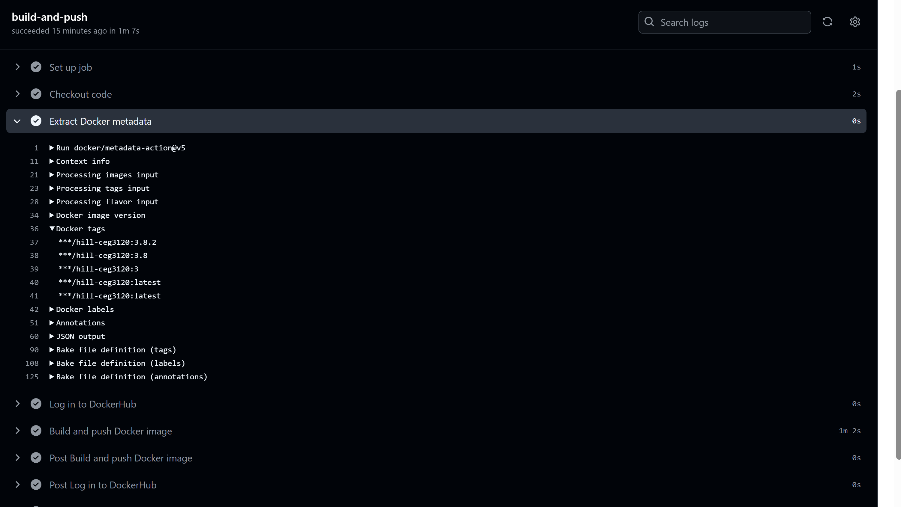

# Semantic versioning

## Generating Tags
- To see tags in the repo, it's easy, run the command: `git tag`
- Generating a tag is just as easy, run the command: `git tag -a v<version number>`. Example - `git tag -a v3.8.1`
- To push a tag, run the command: `git push origin <tag>`. Example - `git push origin v3.8.1`

## Semantic Versioning Container images with github actions

- My new workflow will now execute the job based on when a git tag is pushed instead of when something is pushed to main branch. It still builds a docker image, but now it tags the image with the specified version. Before, it was always tagged with "latest". Then the image gets pushed to DockerHub same as before.

- The steps are similar, but there are a couple new steps and some old ones were changed. The job now executes upon tag push. The code gets pulled into the runner (same as before). The tag will get generated using the metadata-action, this will generate either major, minor, patch, or latest (this is new). Login into DockerHub using github secrets (same as before). Build and push the image with the generated tags (the tags are new, before was always latest).

- The values in the yaml file that would need to updated if used in a different repository: images would require a new repo name. Context would require the new directory where the Dockerfile is. The DOCKERHUB_TOKEN would need to be different as well because it's connected to the current repo using a PAT.
- If it's a new project then the Dockerfile would need updated, and the workflow file itself would need to exist in the new repo as well.

- Workflow link: https://github.com/WSU-kduncan/ceg3120-cicd-OHill26/tree/main/.github/workflows


## Testing

- There are several ways to test if the workflow did it's tasking. I will visually show it by pushing a tag, then taking a screenshot of the logs success.

- To verify if the DockerHub Image works you can pull the image, using a specified existing tag, and run it. Then you can see if the correct version is running on your local system.




# Continuous deployment

## EC2 details
- AMI Details: I switched my AMI to Ubuntu version 20.04. Previously, I used Amazon-Linux 2 for my projects but this was not fun to use.
- InstanceType info: I switched my instance type from t2.micro to t2.medium to meet the requirements of 2 CPU Core and 4 GB RAM.
- VolumeSize: I specified to allocate 30gb of disk space. Honestly, I'm not sure why 30 is picked. I didn't think the docker files were that large. But this is would I did because it follows the lab document.
- SecurityGroup config: I left everything that I had previously from project 2, but I added access anywhere from and to port 9000 from anywhere and port 4200 from anywhere.
- SecurityGroup Justification: This is so I can have my script implement the continuous development. Port 9000 is where I have my site set up so it is where the webhook listening is implemented. Now I allowed my ec2 instance to get post requests from port 9000 so my script can run when it receives the request. I added the port 4200 from anywhere because this is the port my site is on and by default AWS denies access.

## Docker Setup for the instance
- Installing Docker: To install docker on the instance, I was able to use apt instead of dnf now, but in my yaml file I was able to run `apt install -y docker.io`. The 'y' automatically answers yes to any installation questions. I also started and enabled docker and had it pull my image from DockerHub and run it.
- Dependencies: I didn't install any dependencies like angulor or node because I pulled my image from my repo which contains everything I need to run the container.
- Testing docker: To check if docker is installed in the instance you can run any docker command. If installed properly, your system will recognize the command. You can run `docker --version`. 
- Testing running containers: The way I tested to see if my ec2 instance can run containers is obviously by trying to run a container. I used the command `sudo docker run -d -p 4200:4200 --name hill-app ohill26/hill-ceg3120:latest` and then to see if it worked I went to `http://http://54.158.8.74:4200/`. The Ip Address is the public IP from my instance.

## Testing on EC2 instance
- DockerHub pulling: The way I pulled the image was actually in the yaml file. `docker pull ohill26/hill-ceg3120:latest`. Very simple. This is the same image I used to test if the container runs.
- The way I can run the container from the image is after pulling the image from DockerHub, I can run the command `sudo docker run -d -p 4200:4200 --name hill-app ohill26/hill-ceg3120:latest`. The -d means to run it detached from the terminal. -p is just specifying the port.
- Testing: For testing, I recommend running the -it flag instead of -d. When you run -it, it will leave you in the console to interact with the container. This way, you can actively run commands to send the container input for testing/debugging. -d is better for longterm deployment.
- How to validate if the container is running from the container side: To check this, I went inside of the container console using `docker exec -it hill-app /bin/bash`. This is the same thing as running the -it flag. Once here, I ran the command `curl http://localhost:4200`. If you see html, the container is working properly (which I did)[2]. See references for this
- Testing the container outside if host: This is a similar process to before, but I want to run the curl command outside of the docker container. Run the `curl http://localhost:4200` command outside of the container [2].
- Testing from External System: Go into a browser and nagivate to to http://54.158.8.74:4200/. If it works and security groups are set up correctly, it will load the angular site [2].

## Scripting container refresh
- I created this script so I can use it to actually implement continuous deployment. The idea is that when a request gets called this script will run and do the neccessary things to refresh the site. The things it does is pull the image from DockerHub, kill and remove the previous image that was running, and start the newly pulled container.
- Pulling image: To pull the image, I wrote the code `sudo docker pull image $IMAGE_NAME`. IMAGE_NAME is a constant that is set to my image name [3].
- Stopping image: Code is `sudo docker stop $CONTAINER_NAME 2>/dev/null` The 2>/dev/null makes it so any error messages are discarded (the null) [3].
- Killing, removing are the same as the stopping above [3].
- Starting: This is the same command used before in the section up above.

- To test the script of couse run it with `./refresh-container.sh`. I knew it worked because after running the script, the site worked but I also checked the docker processes with `sudo docker ps` and it said the image started running a second ago, meaning it did refresh.

- Link to script in GitHub: https://github.com/WSU-kduncan/ceg3120-cicd-OHill26/blob/main/refresh-container.sh

## configuring webhooks listener
- To install webhooks originally I installed golang but I didn't need this, I just needed to do `sudo apt install webhook`.
- To verify if successful I can run any webhook command and it should be recongized if installed correctly. I ran `webhook -h`.
- Webhooks definition summary: This is a .json file that handles when a push request is made to github. When it detects this, it calls the script file I made earlier to get the new changes and refresh the site. This does not work for push requests to DockerHub, just GitHub. So push to DockerHub first, then Github. The file contains an identifier for the hook, the command to run (the script), the working directory, a response message I defined, a trigger rule (push), anda secret for security so this only works when trusted sources push to the repo.
- file definition verification: For this I ran the command `webhook -hooks /home/ubuntu/hooks.json -port 9000 -verbose`. You should get a particular output if it works correctly, which I did. 
- The way I checked to see if it was recieving payloads correctly was by pushing something to github. This only worked because I setup github webhooks prior to doing this.
- Logs: monitoring logs is easy, when you run the `webhooks - hooks /home/ubuntu/hooks.json -port 9000 -verbose` it automatically puts you in the logs. Anytime a request happens it will automatically pop up here.
- Docker process views: You can use this to see the status of any containers. Use `docker ps -a`.

## Configuring a payload
- I chose github because it's super easy and I remember how to do it from class. This does mean that obviously pushing to dockerhub won't run my script.
- The selection that causes the trigger is a push to the github repo from a user with the correct security token.
- The json file I created handles all of this, it contains all the logic for webhooks to use the script I created.
- The way I verified a successful payload was first by pushing something to github, but then to check I can go to webhooks in github and it will either say delivery unsuccessful, or successful. If it says unsuccesfful, it may be because the port isn't actively listening. If this is the case run the command `webhook -hooks /home/ubuntu/hooks.json -port 9000 -verbose`.

## Configuring a webhook on EC2
- The service is telling the webhook server to listen for HTTP POST requests. When the correct requests are recieved, defined in my hooks.json, it triggers my bash script to run. It is set to restart after if service fails. Logs are sent to systemd journal.
- To enable and start webhook: Need to reload systemd to pick up any changes made to the service with `sudo systemctl daemon-reload`. To enable the service run `sudo systemctl enable webhook.service`. Once enabled, it can be started with`sudo systemctl start webhook.service`. To check if the service is running correctly, run `sudo systemctl status webhook.service`.
- how to test: The way I tested it was having chatgpt generate a command for me to run, `curl -X POST http://<your-ec2-public-ip>:9000/hooks/refresh-container \
  -H "Content-Type: application/json" \
  -H "X-Hub-Signature: my-secret-token" \
  -d '{"ref": "push"}'`. After running this, my output was as expected and was succesful

# References for Project 5

- For part 1, I used generative AI to make the new additions of my yaml file. The prompt I gave was my current yaml file, and I said to make these changes, then I pasted the task#2 to the prompt.
- Asked ChatGPT how to test that the DockerHub Image works using the specified versions.
- [2] - Used chatGpt for testing, I copied ```How to verify that the container is successfully serving the Angular application
validate from container side
validate from host side
validate from an external connection (your physical system)``` and pasted it in chatgpt.
- [3] - Used ChatGpt to create my bash script. The prompt I gave it was ```Scripting Container Application Refresh
Create a bash script on your instance that will:
pull the image from your DockerHub repository
kill and remove the previously running container
start a new container with the freshly pulled image.```
- [4] - Used chatgpt to help me write the definition file. I gave it many prompts and didn't record them all but the main one was ```Create a configuration file - a hook definition - for webhook to load when ran. The hook definition should:
Trigger your bash script to run when a payload is received
Validate that the payload came from a trusted source via a shared secret or by validating payload is from DockerHub or GitHub``` and here I then asked it several more things, mostly about setting up security tokens.
- [5] - Used chatgpt to generate the service file contents I needed. The prompt was ```Build me a webhook service file```. I had to make several changes because the ExecStart was not correct nor the user.
- [6] - had to ask chatgpt how to test several things. It gave me the commands to restart, enable and start the systemd and the service. Gave me the command to test the service in the last section for part 2.
