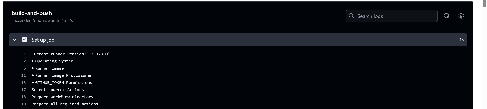
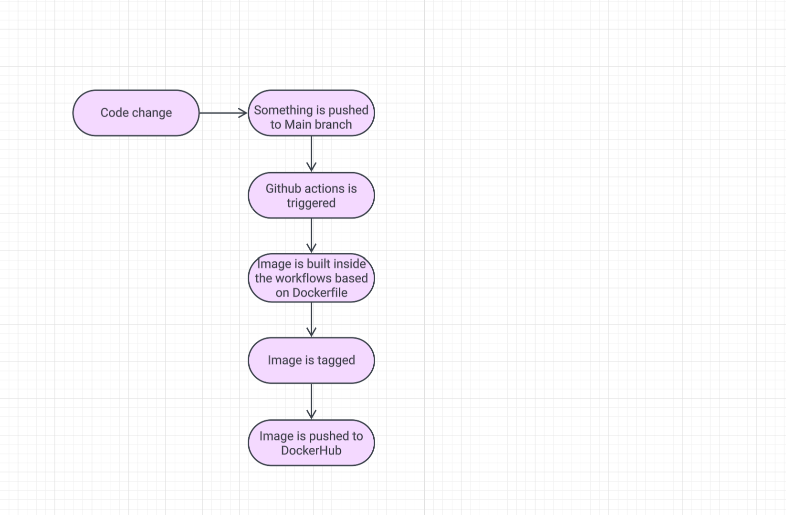
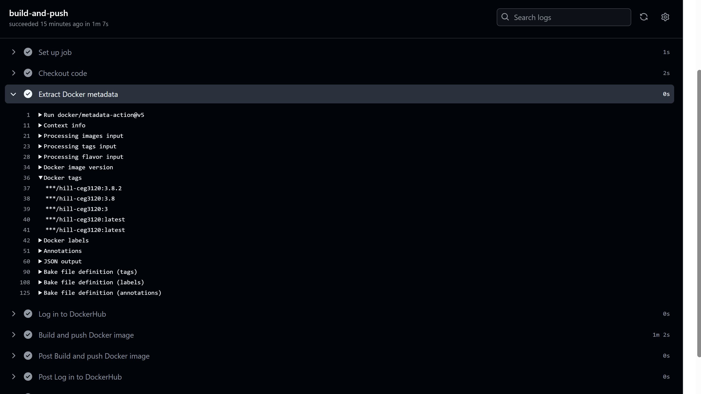

# CI PROJECT OVERVIEW
- I'm working with an angular front-end to implement containerization via docker. The purpose of this project is to understand how and why to use containers. We are using containers to create an environment that runs the same of any system despite the local files that exist. That means when someone accesses my website, it runs on the containers angular and node version, and voids whatever local versions are installed. This creates an even playing field for anyone trying to access my site.

# How to containerize
- Docker is the only thing we need to download to containerize. To actually create the code via angular, node.js, typescript etc. is a different problem that is not addressed here.

- To run the container without building an image for it, you can use a pre-existing image from dockerhub. After you have that image, you can use the `docker run` command. You will have to add additional flags to the command to specify the working directory, and mount location. In my case, I used node:18-bullseye.

- The instructions that exist inside my Dockerfile include the image to use (node:18-bullseye), the working directory (where commands will get ran), the json files that configure the angular app, npm install to install all dependencies inside of the angular config (.json), all of the rest of the project files, the port to expose the site too, and ng serve to start the app and specify the host so it allows connections from anywhere.

- Now that we have our Dockerfile we can build the image. This is straight-forward, we can just use `docker build -t <image_name> .` The image name is whatever you want to call it, I called it angular-site. The "." is to specify the docker location.

- Now that we have an image we can run this image to start the site. I used `docker run -p 4200:4200 angular-site` This will run the site and make it accessible in port 4200.

- To view the application go to port 4200 in your web browser using local host.

# DockerHub:
- To create a repo to store images in, go to dockerhub, make an account, create a new repo.

- You can authenticate your dockerhub to your local in several ways, all of which include logging in some fashion. I created a public access token in dockerhub, then in my cli, i ran `docker login -u ohill26`. This would prompt me for a password which is generated when creating the PAT. Now there is an established connection.

- To push an image you can tag it, then push it. In my case, I just rebuilt the original image that was called "angular-site" to "ohill26/hill-ceg3120" and ran `docker push ohill26/hill-ceg3120`. This will also generate a default tag for you.

# Link to dockerhub:
- https://hub.docker.com/r/ohill26/hill-ceg3120

# Configuring GitHub Secrets
- Went to settings inside of the repository -> Secrets and variables -> actions. Here, create new repository secret. Created both a dockerhub_token, this holds the passcode generated when creating a new PAT in dockerhub. Additionally, created a docker_username token that holds my dockerhub username. This will be used to set up github workflows where I can build and push images to my dockerhub using git actions (kind of).

# CI with GitHub actions
- The workflow checks out to the repo's code when something is pushed to the main branch. Then it logs in and makes a connection to my dockerhub using the secrets created above, builds a Docker image from my Dockerfile, and pushes this to the specified DockerHub repo.

- The way the workflow works is it defines when to do the job (on push to main). Set what the job runs on (ubuntu-latest). Set the permissions awared to the job (read from git and write to Docker repo). The steps clones the repo into the environment, and checkouts the code (locks a copy of the code here so it can be modified). Then log into DockerHub using the secrets. Then builds and pushes the image to DockerHub (using context which locates where the Dockerfile is). Set the tag for the push (latest in our case).

- Link to worflow file in github:https://github.com/WSU-kduncan/ceg3120-cicd-OHill26/blob/main/.github/workflows/owenhill-cd.yaml

# How to test workflows?
- To test if the workflow file works we can push something to the repo and check the actions list.

# Reflection (Part 3)
- The goal of this project was to implement continuous integration into our workflow. Everytime something is pushed to the main branch in github (probably code change to angular project), we want the Docker image to update automatically and therefor, the DockerHub repo as well.

# Tools used
- Angular: Used for web development
- Node.js: Used for web development
- DockerHub: Used to store an image
- Git: Used as a version control tool for my code base
- ubuntu: Used as an interface tool
- Used PAT inside of DockerHub to connect it to my Git repo and my ubuntu instance
- GitHub actions: Used to implement continuous integration via yaml file

# Resources

- I did use chatgpt ONLY to help me write the docker file. I don't remember the exact prompt I gave it, but I believe it was along the lines of "Create a dockerfile that runs my site using Node.js version 18 and Angular version 15.03.
- I used ChatGPT for help building my yaml file for the work flows. I copy and pasted the requirements from the lab document for creating the workflows. From there I took their generated file and edited context and tags.
- I used lucidcharts to build my diagram.

# Semantic versioning

## Generating Tags
- To see tags in the repo, it's easy, run the command: `git tag`
- Generating a tag is just as easy, run the command: `git tag v<version number>`. Example - `git tag v3.8.1`
- To push a tag, run the command: `git push origin <tag>`. Example - `git push origin v3.8.1`

## Semantic Versioning Container images with github actions

- My new workflow will now execute the job based on when a git tag is pushed instead of when something is pushed to main branch. It still builds a docker image, but now it tags the image with the specified version. Before, it was always tagged with "latest". Then the image gets pushed to DockerHub same as before.

- The steps are similar, but there are a couple new steps and some old ones were changed. The job now executes upon tag push. The code gets pulled into the runner (same as before). The tag will get generated using the metadata-action, this will generate either major, minor, patch, or latest (this is new). Login into DockerHub using github secrets (same as before). Build and push the image with the generated tags (the tags are new, before was always latest).

- The values in the yaml file that would need to updated if used in a different repository: images would require a new repo name. Context would require the new directory where the Dockerfile is. The DOCKERHUB_TOKEN would need to be different as well because it's connected to the current repo using a PAT.
- If it's a new project then the Dockerfile would need updated, and the workflow file itself would need to exist in the new repo as well.

- Workflow link: https://github.com/WSU-kduncan/ceg3120-cicd-OHill26/tree/main/.github/workflows

## Testing

- There are several ways to test if the workflow did it's tasking. I will visually show it by pushing a tag, then taking a screenshot of the logs success.

- To verify if the DockerHub Image works you can pull the image, using a specified existing tag, and run it. Then you can see if the correct version is running on your local system.

# References for Project 5

- For part 1, I used generative AI to make the new additions of my yaml file. The prompt I gave was my current yaml file, and I said to make these changes, then I pasted the task#2 to the prompt.
- Asked ChatGPT how to test that the DockerHub Image works using the specified versions.
